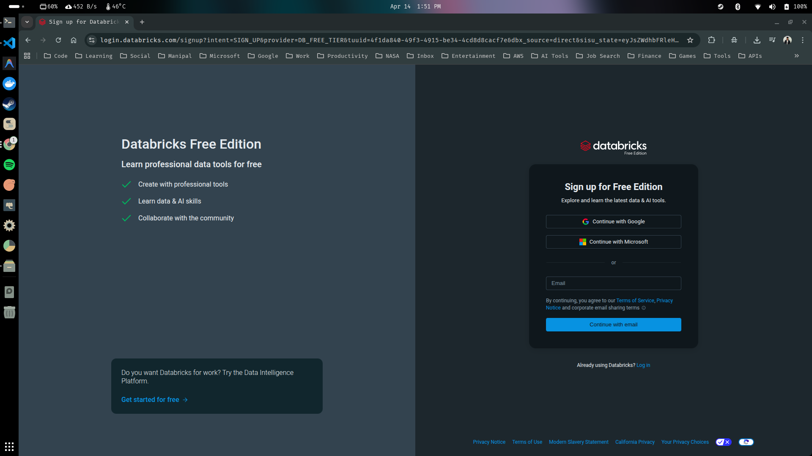
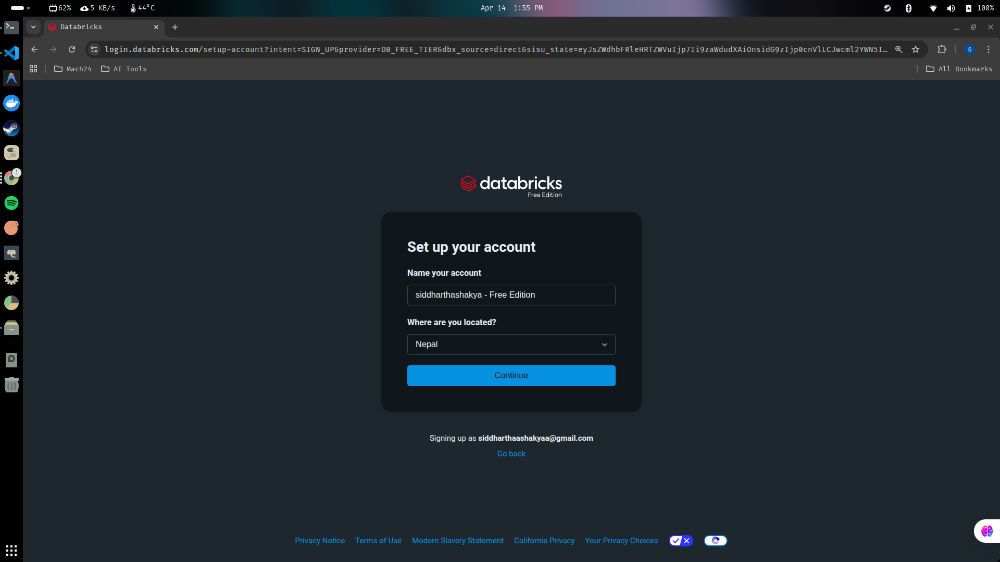
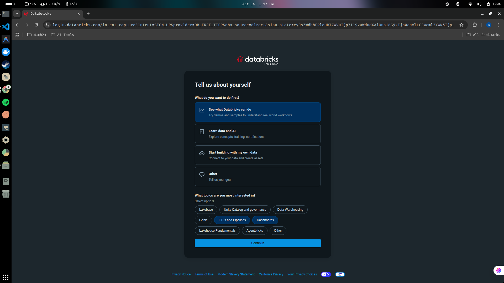
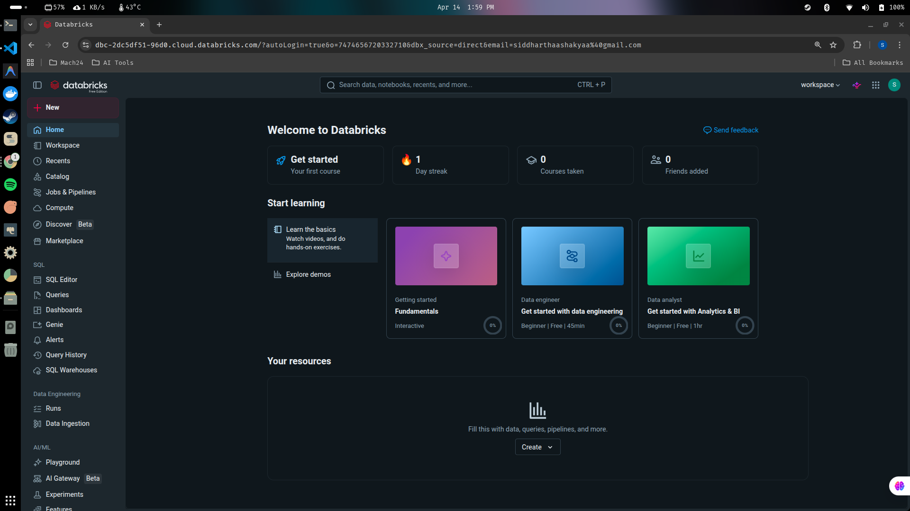

## Setting Up a Databricks Workspace

The first step to do the practice and learning of our databricks, would be to create a databricks account and workspace. 

> Prerequisites for creating databrick account and workspace are:

- Atleast one cloud account (Azure, Google Cloud, AWS).
- However, if you dont have the above prequisite and still want to use it completely for free, then you can choose **Databricks Community Edition**.

*Let's create a Databricks account (Community Edition):*

1. Go to the Databricks Free Edition login/signup page with the link given below:

- Databricks Free Edition : [Databricks Community Edition](https://login.databricks.com/signup?intent=SIGN_UP&provider=DB_FREE_TIER&tuuid=4f1da840-49f3-4915-be34-4cd8d8cacf7e&dbx_source=direct&sisu_state=eyJsZWdhbFRleHRTZWVuIjp7Ii9zaWdudXAiOnsidG9zIjp0cnVlLCJwcml2YWN5Ijp0cnVlLCJjb3Jwb3JhdGVFbWFpbFNoYXJpbmciOnRydWV9fX0%3D)

- You should see the page similar to below one:

2. Click on continue with google and signup with your google account, and set up your account accordingly.

3. Tell them about yourself.

4. Your new databricks account (free edition) has been created successfully.

> [!NOTE]
> Remember that the account we created is a free trial account, that doesn't use any cloud service provider. In this free trial account, few of the things are limited. For example, when we are going to learn the scheduling of the job, those features we will not find, but majority of the things which is covered in this course, we can do it with the community edition as well.

---

# 
Thank You for Going Through This Guide! 🙏✨

