## Navigating the Databricks Interface

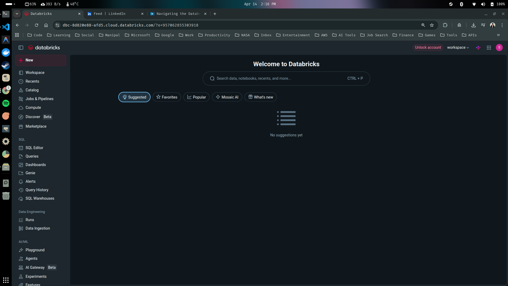

Databricks account has multiple properties and functionalities. If this is your first time seeing this databricks workspace, then this guide is for you.

Let's have a walkthrough and see what are the functionalities available and how we can use the databricks user interface.

- You can see multiple tabs on the left-hand side. 

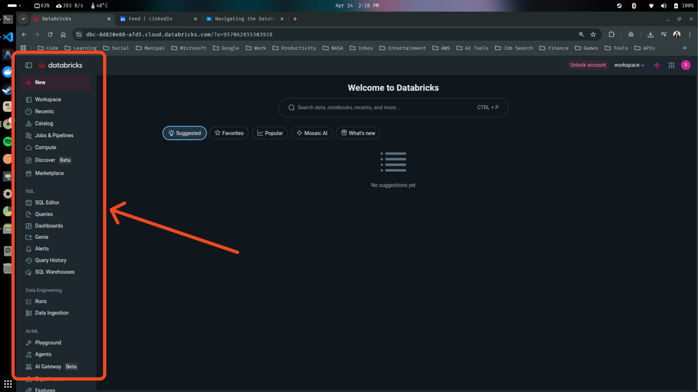

- You can click on the top 'New' button to create anything (like notebooks, query, dashboards, jobs, pipelines) new into the databricks.

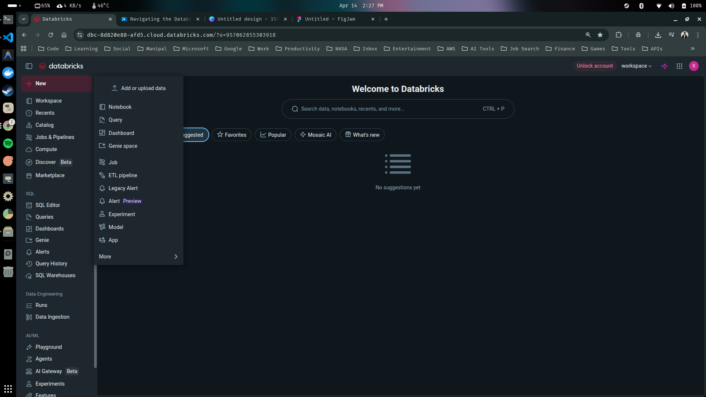

*You can also upload some sample data from this new button.*

- If you want to walk through, how many files you have already created and where they are located folder-wise. You can click on the 'Workspace' tab, from where you will be able to see the folder hierarchy of all your notebooks and the files.

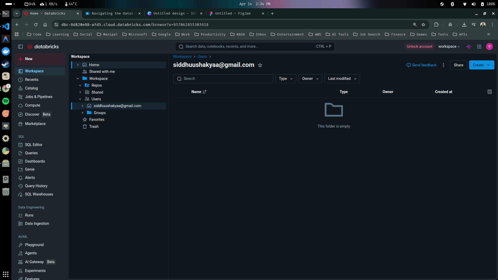

*At the moment this will be empty, as we just created a new workspace. As we are going to create multiple notebooks, you will start al those notebooks along with folder here.*

- In the 'Recent' tab you can see all the recent items which you have opened or interacted with. It could be notebooks, dashboards, pipelines or anything.

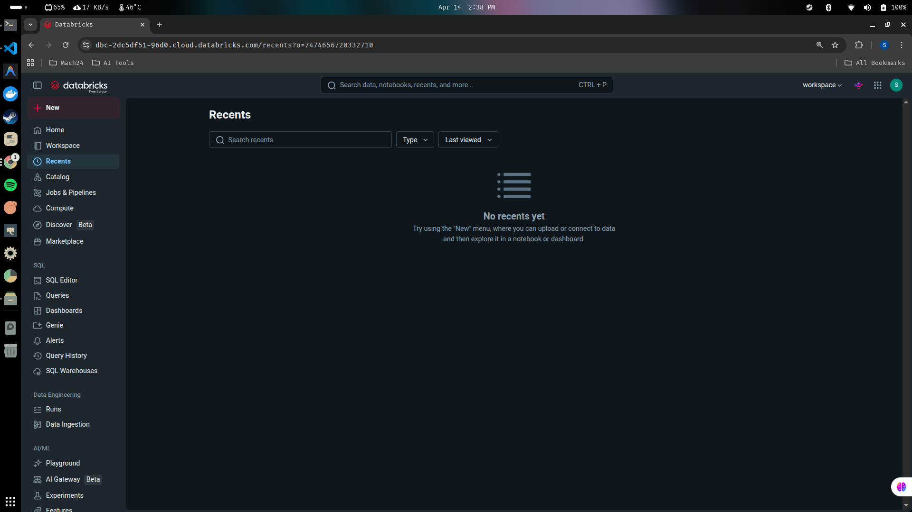

- In the 'Catalog' tab, you can see all the tables, which you have created in the databricks. Databricks allows you to create the tables in the form of delta tables, which you will be able to see here.

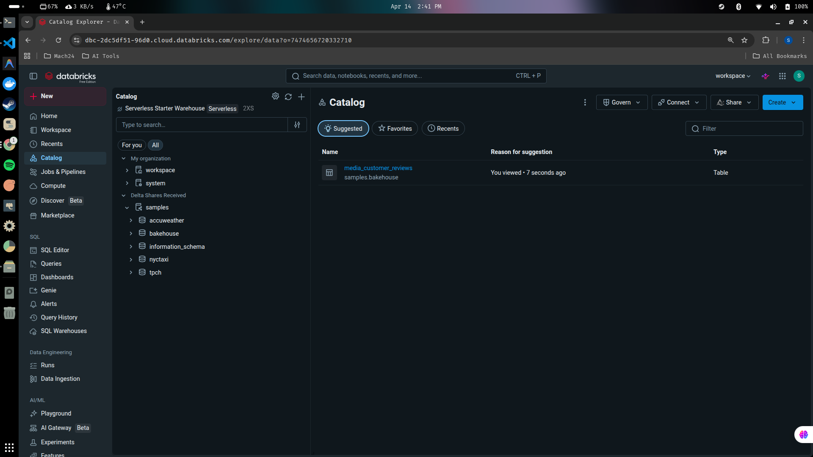

- Another tab, which we are going to use frequently is this 'Compute' tab. 

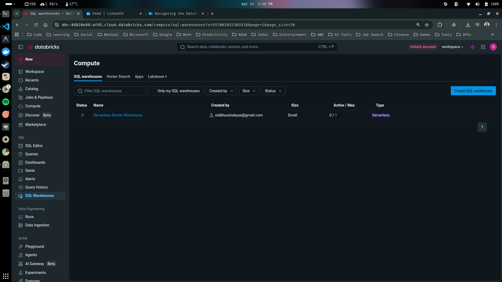

*For running anything into the databricks, we need to have the cluster and with this compute tab, you can create the cluster.*

> [!NOTE]
> You won't be able to create a cluster of your own, since we are using the databricks free edition (not linked to AWS/GCP/Azure). We don't get full cluster control and we are given a serverless compute only. 

> What serverless means for us

- No cluster setup needed
- You just run notebooks → compute starts automatically
- Limited configuration (you can’t choose memory, cores, Spark version, etc.)

- If you want to do anything related to SQL, you can do it from the 'SQL Editor' and 'Dashboards' tab. 

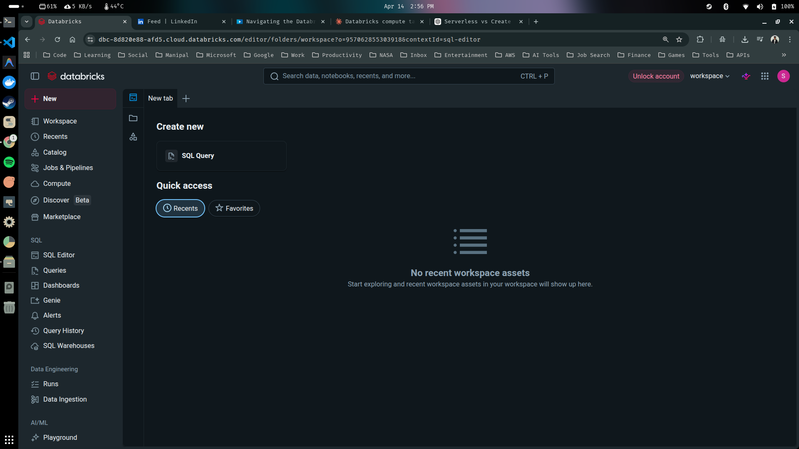

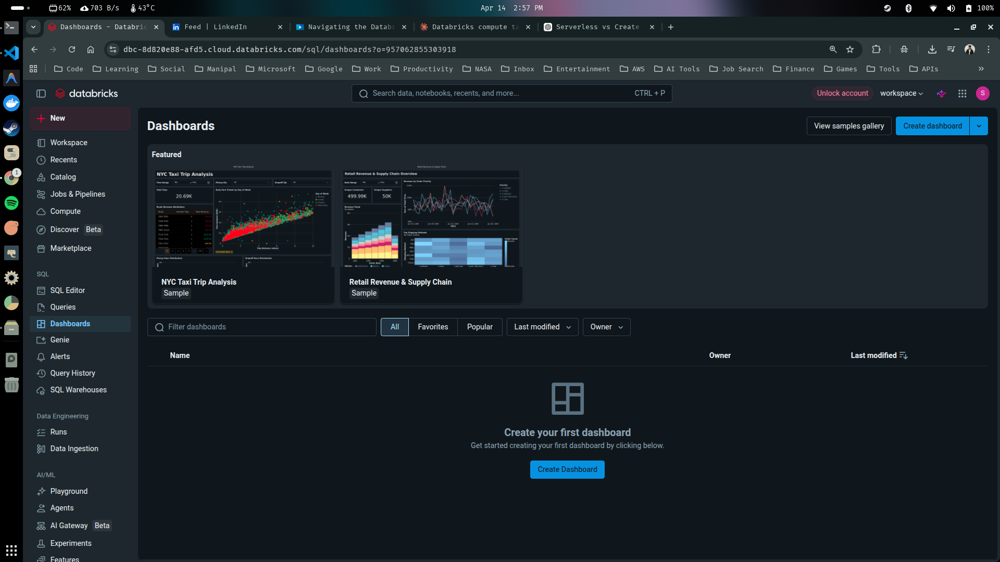

*You can run queries, dashboards and you can access all of them from here.*

- Similarly, if you run multiple jobs and you want to see those job runs, you can come to the 'Data Engineering' section and you can see all the jobs status and their history from the 'Runs' tab.

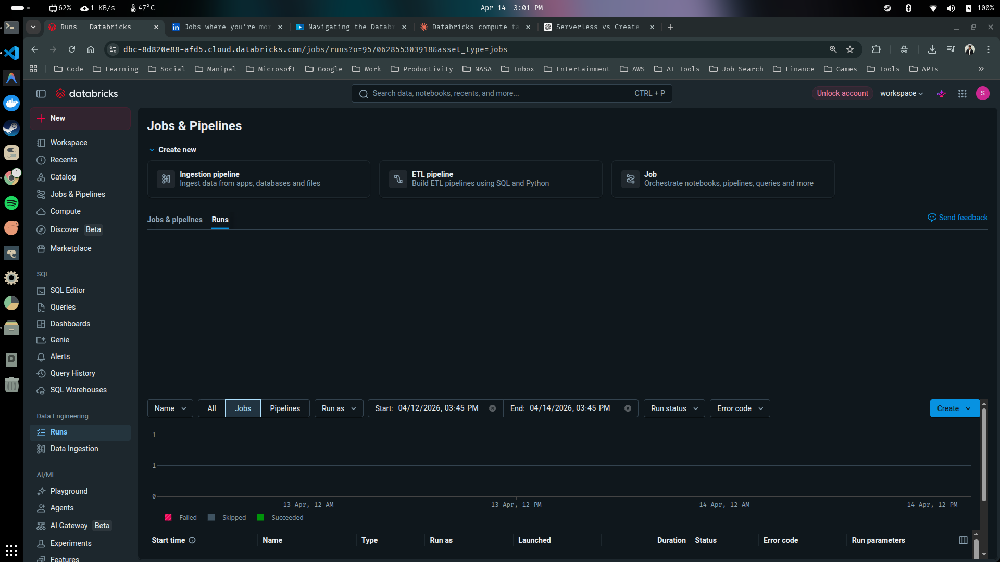

-If you're using the databricks from the perspective of AI and ML, then there is a specific section called 'AI/ML' where you have tabs like 'Playground' and 'Experiments' to see stuff related to Machine Learning.

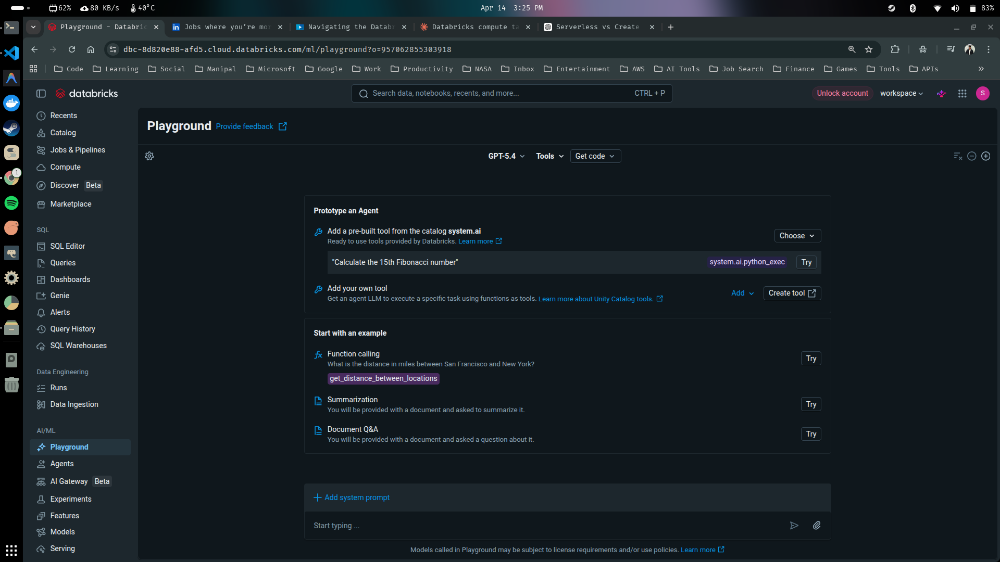

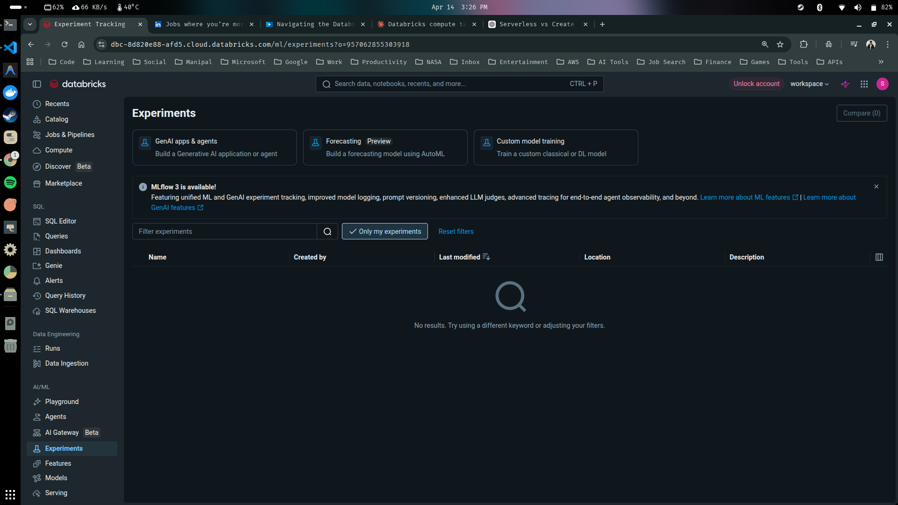

- If you click on the right-hand side top corner, you will see the settings. You can click on the settings and change the appearance (light mode) from the 'Preferences' tab.

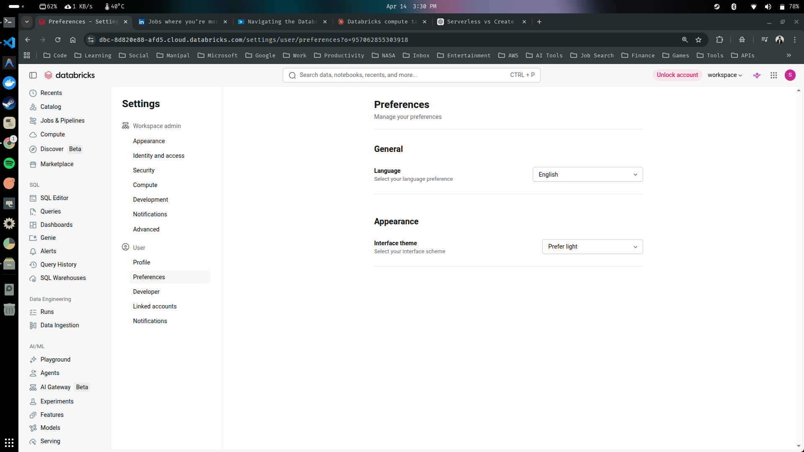

- You can also change user preferences or can assign different groups and users by using the 'Identity and access' tab.

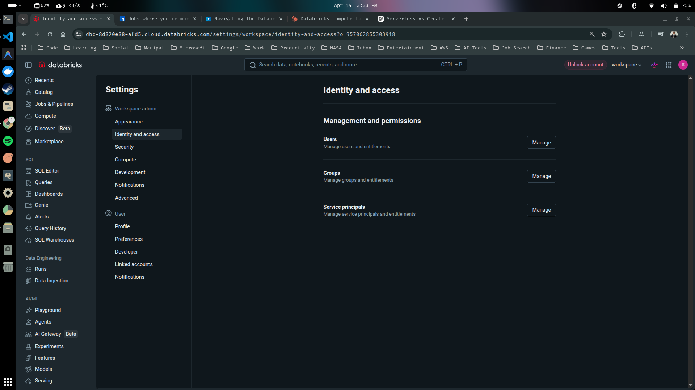

- On the right hand side, you can also see the workspace name. You might have multiple workspaces. For example, you might have a different workspace for dev environment, UAT environment, and the production environment.

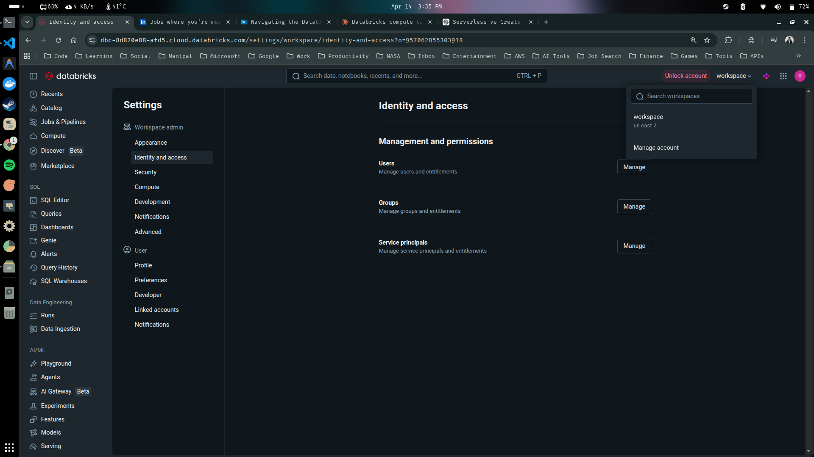

*You can easily switch between these workspaces by simply clicking on it.*

---

# 
Thank You for Going Through This Guide! 🙏✨
