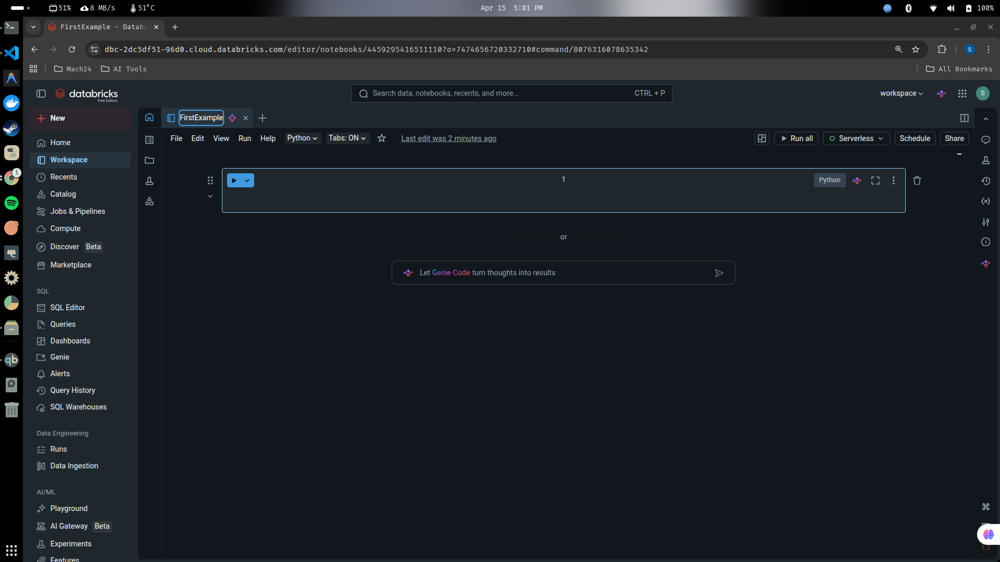
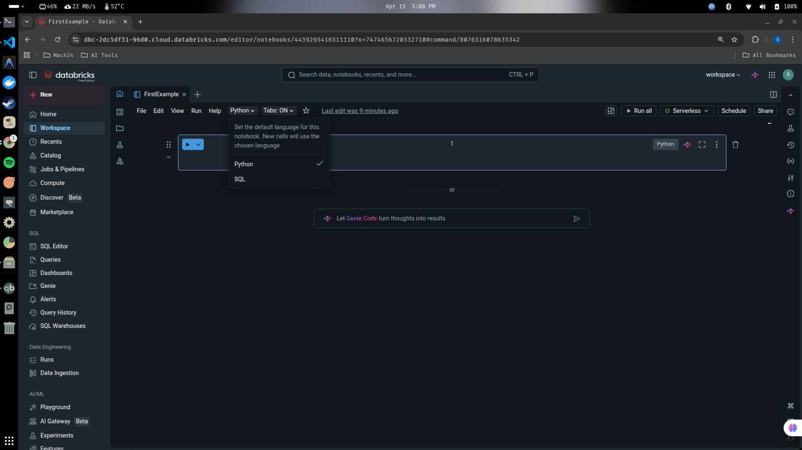
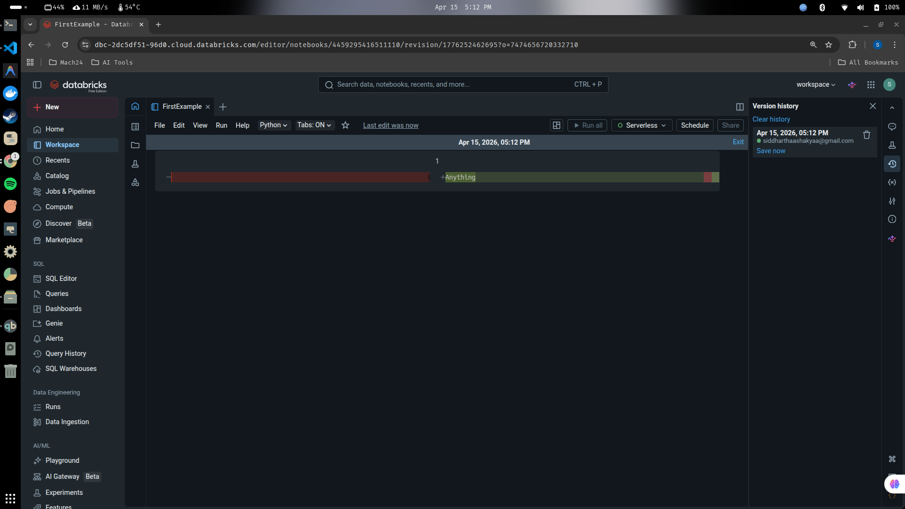

## Databricks Notebooks

Databricks notebooks is an place where we are going to write all our databricks logic and code. So, let's see how we can create the databricks notebooks.

1. You can click on the top 'New' button and then click on the 'Notebook' to create a new notebook.

2. You will be able to see your new notebook, and now you can also click on the name and change it to whatever we want (FirstExample).

3. By default, this notebook is of python, if you want to change it to SQL or any other type like R or Scala, you can click on the python (side of help button) and switch it as per your wish.

> [!NOTE]
> For the entirety of this course, we will be using the python notebook and which is the default one as well. Also keep in mind that this notebook has an **Autosave** feature.

4. If you want to see what changes you have done, on the right hand side, you can see the version history. Click on the 'Version history' and see who did what change.

You can also roll it back to previous version accordingly.

> This databrick notebook works very similar to google colab and jupyter notebook.

---

# 
Thank You for Going Through This Guide! 🙏✨

